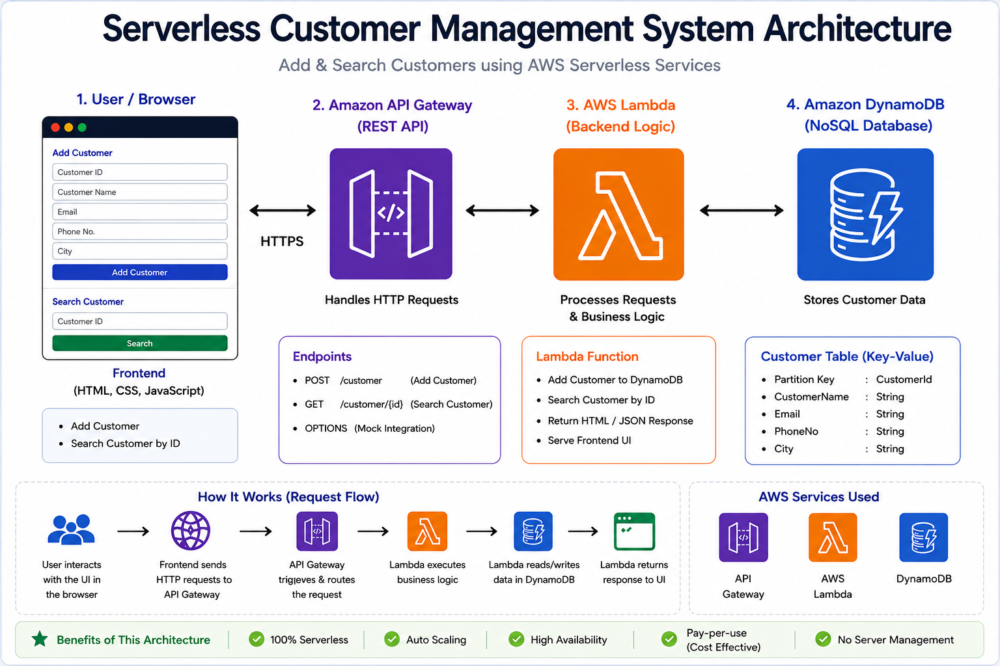
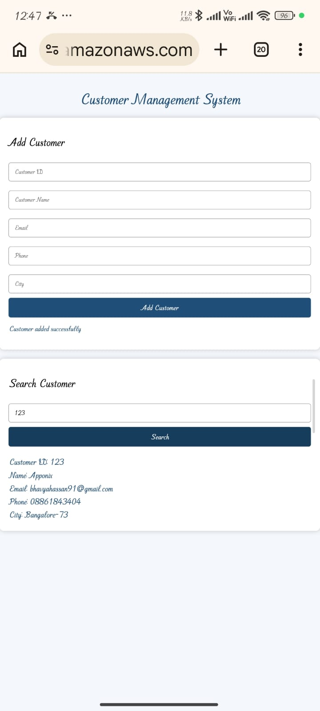

# 🚀 Serverless Customer Management System

A cloud-native serverless web application that enables users to add and search customer records using REST APIs. Built using AWS Lambda, Amazon API Gateway, Amazon DynamoDB, IAM, HTML, CSS, and JavaScript, the application demonstrates scalable serverless architecture, secure cloud integration, and NoSQL database operations.

---

## 📌 Project Overview

This project implements a fully serverless customer management system using AWS managed services. Users can add new customer records and retrieve existing customer details through a responsive web interface. The backend is powered by AWS Lambda and exposed through Amazon API Gateway REST APIs, while Amazon DynamoDB stores customer information.

> **Note:** This project was successfully developed, tested, and deployed on AWS Free Tier. To avoid unnecessary AWS resource usage and charges, the cloud resources were removed after successful testing. The complete source code, architecture, and screenshots are available in this repository.

---

## 🏗 AWS Architecture

The application follows a serverless architecture where users interact with a responsive web interface built using HTML, CSS, and JavaScript. Customer requests are sent to Amazon API Gateway REST APIs, which invoke AWS Lambda to process the application logic. AWS Lambda stores and retrieves customer information from Amazon DynamoDB, while AWS IAM provides secure access between AWS services and Amazon CloudWatch captures logs for monitoring and troubleshooting.

<p align="center">
  
</p>

---

## ✨ Features

- Add new customer records
- Search customers by Customer ID
- REST API integration using Amazon API Gateway
- Serverless backend using AWS Lambda
- Data storage using Amazon DynamoDB
- Secure access with AWS IAM
- CORS support for browser-based requests
- CloudWatch logging for monitoring and debugging
- Responsive user interface built with HTML, CSS, and JavaScript

---

## 🛠 Technical Stack

### Cloud Services
- AWS Lambda
- Amazon API Gateway (REST API)
- Amazon DynamoDB
- AWS IAM
- Amazon CloudWatch

### Frontend
- HTML5
- CSS3
- JavaScript

### Backend
- Python
- Boto3 (AWS SDK for Python)

### Development & Version control
- Git
- GitHub

### API Testing
- Postman

---

## 📁 Project Structure

```text
Serverless-Customer-Management-System/
│
├──architecture/
│   └── architecture.png
│
├── frontend/
│   ├── index.html
│   ├── style.css
│   └── script.js
│
├── lambda/
│   └── lambda_function.py
│
├── screenshots/
│   └── application-ui.png
│

├── .gitignore
└── README.md
```
---

## ⚙️ Application Workflow

1. The user accesses the web application through the browser.
2. The frontend (HTML, CSS, and JavaScript) collects customer information or a Customer ID.
3. The request is sent to Amazon API Gateway using REST APIs.
4. Amazon API Gateway invokes the AWS Lambda function.
5. AWS Lambda processes the request and performs the required database operation.
6. Customer records are stored in or retrieved from Amazon DynamoDB.
7. The Lambda function returns the response through API Gateway.
8. The frontend displays the result to the user.

---

## 📷 Application Screenshot

The screenshot below shows the web interface used to add and search customer records. The application communicates with Amazon API Gateway REST APIs, which invoke AWS Lambda functions to process requests and interact with Amazon DynamoDB for data storage and retrieval

<p align="center">
  
</p>

----

## 🚀 Future Enhancements

- Implement Update and Delete operations to support complete CRUD functionality.
- Add user authentication and authorization using Amazon Cognito.
- Enhance input validation and error handling for improved reliability.
- Deploy the frontend using Amazon S3 and Amazon CloudFront for public hosting.
- Automate infrastructure deployment using AWS CloudFormation.
- Implement CI/CD pipelines for automated testing and deployment.


---

## 👩‍💻 Author

**Mullaguri Divya**

- LinkedIn: https://www.linkedin.com/in/mullaguri-divya
- GitHub: https://github.com/Mullaguridivya

If you found this project helpful or have suggestions for improvement, feel free to connect with me.

